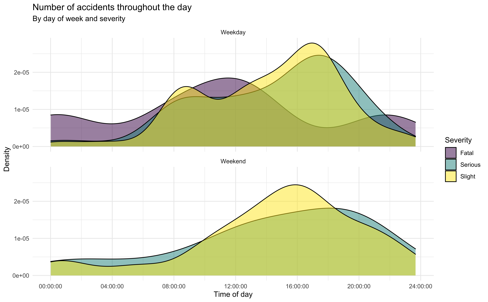

В этом задании мы рассмотрим дорожные происшествия в Эдинбурге.
Данные сделаны доступными [online](https://data.gov.uk/dataset/cb7ae6f0-4be6-4935-9277-47e5ce24a11f/road-safety-data/datafile/36f1658e-b709-47e7-9f56-cca7aefeb8fe/preview) Правительством Великобритании.
Данные покрывают все дорожные происшествия в Эдинбурге за 2018 год, некоторые переменные были модифицированы для настоящего задания.

## Данные

Данные содержатся в пакете **dsbox** в объекте `accidents`.
Для доступа к этим данным достаточно загрузить пакет.
Узнать больше о структуре набора данных можно, обратившись к документации, для чего в консоли нужно набрать `?accidents`.
Эту информацию также можно найти [здесь](https://rstudio-education.github.io/dsbox/reference/accidents.html).


## Загрузка пакетов и данных

```{r load-packages, message = FALSE}
library(tidyverse)
library(dsbox)
```

## Упражнения

### Упражнение 1

Сколько наблюдений (строк) содержится в наборе данных? Для ответа используйте код-в-строке (inline code).

```{r n_rows}
nrow(accidents)
```

---

В данных содержится 768 строк.

### Упражнение 2

Выполните выражение `View(accidents)` в консоли для просмотра данных на панели источников. Что представляет собой каждая строка в наборе данных?

```{r view_data, eval = F}
View(accidents)
```

---

Каждая строка представляет собой одно наблюдение - дорожное происшествие.

### Упражнение 3

Воссоздайте следующий график, опишите его в контексте данных. 



Не забудьте переименовать фрагмент кода (там, где сейчас указано `label-me-1`). Имя должно быть коротким, информативным и не должно содержать пробелов, а также не должно повторять имя предыдущего фрагмента.

---

Вероятность фатальных происшествий стремится к нулю в выходные; в будни в рапределении плотности вероятности есть две моды - в полуденное и в ночное время. В выходные распределение плотности для аварий с легкими и тяжелыми повреждениями имеет похожую форму и характеризуется пиком в послеобеденное время. Для распределения плотности вероятности несерьезных аварий в будни характерно также небольшое увеличение в утренние часы.

```{r plot_two_panels}
accidents2 <- accidents |>
  mutate(is_weekend = factor(as.numeric(day_of_week == 'Saturday' | day_of_week == 'Sunday'), 
                             labels = c('Weekday', 'Weekend'))) |>
  select(time, severity, is_weekend)


ggplot(accidents2, aes(x = time, fill = severity)) + 
  geom_density(alpha = 0.4) +
  facet_wrap(~is_weekend, nrow = 2) +
  labs(title = "Number of accidents throughout the day",
       subtitle = "By day of wek and severity",
  x = "Time of day",
  y = "Density",
  fill = "Severity") +
  theme_minimal() +
  scale_fill_viridis_d()
```

### Упражнение 4

Создайте другую визуализацию на основе данных и дайте интерпретацию. Вы можете использовать любые переменные любого типа, но их должно быть не меньше трех, то есть диаграммы рассеяния `x` vs. `y` недостаточно, но если точки будут раскрашены в соответствии с `z`, это нормально. Не забудьте переименовать фрагмент кода (там, где сейчас указано `label-me-2`).

---

Уровни фактора отсортированы примерно в том порядке, в котором увеличивается тяжесть погодных условий, но для наглядности объединяю 7 категорий в 3 (0 - хорошая погода, 1 - относительно нейтральная, 2 - плохая). Решаю убрать значения "Other" и "Unknown" при построении визуализации.
```{r little-eda}
levels(accidents$weather)

level_key <- c(`Fine + no high winds` = 0, 
               `Raining + no high winds` = 1,
               `Snowing + no high winds` = 1,
               `Fine + high winds` = 0,
               `Raining + high winds` = 2,
               `Snowing + high winds` = 2,
               `Fog or mist` = 1)
  
```
А здесь немного поменяю порядок уровней фактора.
```{r little-eda-2}
levels(accidents$severity)
accidents$severity <- factor(accidents$severity, levels = c("Slight", "Serious", "Fatal"))
  
```


```{r scatter, message = FALSE}
accidents |>
  filter(!(weather %in% c("Other", "Unknown"))) |>
  mutate(weather_cat = factor(recode(weather, !!!level_key))) |>
  ggplot(aes(x = longitude, y = latitude, size = severity, color = weather_cat)) +
    geom_point(alpha = 0.2) +
    theme_bw() +
  facet_wrap(~ weather_cat, nrow = 2, ncol = 2)
```

Интерпретация: аварии чаще всего происходят в районе 55.95 с.ш. 3.2 в.д. Там же сконцентрировано большинство аварий со тяжелым и смертельным исходом. Визуально не обнаруживается зависимость между погодой и тяжестью аварии. Аварии чаще происходят при хорошей погоде, реже - при плохой.
