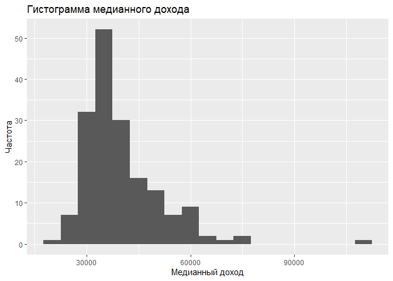
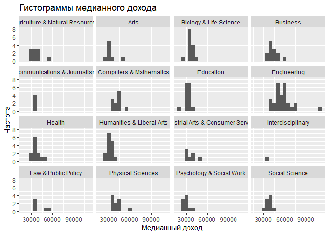
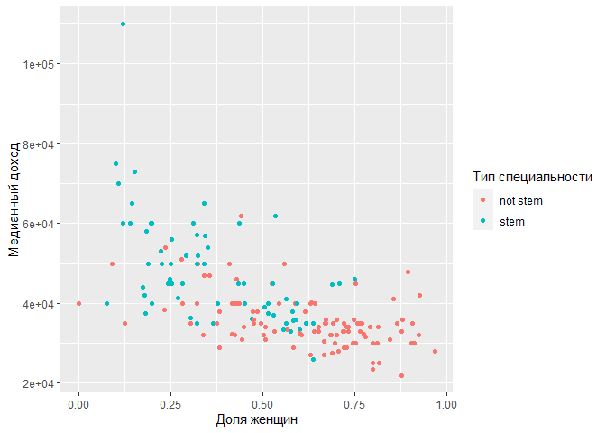

Домашнее задание 04 - Какую специальность выбрать?
================
Insert your name here
Insert date here

Первым шагом в процессе превращения информации в знания является
обобщение и описание необработанной информации - данных. В этом задании
мы исследуем данные по специальностям и доходам в колледжах, в
частности, эти данные используются в статье на сайте FiveThirtyEight
[“The Economic Guide To Picking A College
Major”](https://fivethirtyeight.com/features/the-economic-guide-to-picking-a-college-major/).

Первоначально эти данные взяты из исследования American Community Survey
(ACS) за 2010-2012 годы. Хотя это выходит за рамки этого задания, если
вам интересно, как необработанные данные из ACS были очищены и
подготовлены, см.
[скрипт](https://github.com/fivethirtyeight/data/blob/master/college-majors/college-majors-rscript.R),
который использовали авторы FiveThirtyEight.

Следует также отметить, что при выборе специальности необходимо
учитывать множество факторов. Потенциальный заработок и перспективы
трудоустройства - это два из них, и они важны, но не раскрывают всей
картины. Помните об этом при анализе данных.

## Load packages and data

Мы будем использовать пакет **tidyverse** для большей части обработки и
визуализации данных, пакет **scales** для лучшего форматирования меток
на графиках, а данные содержатся в пакете **fivethirtyeight**.
Убедитесь, что эти пакеты установлены на Вашем компьютере.

``` r
library(tidyverse)
library(scales)
library(fivethirtyeight)
```

## Данные

Данные можно найти в пакете **fivethirtyeight**, набора данных
называется `college_recent_grads`. Поскольку набор данных
распространяется вместе с пакетом, его не нужно загружать его отдельно:
он становится доступен, когда загружается пакет. Вы можете узнать больше
о наборе данных, просмотрев его документацию, к которой вы можете
получить доступ, выполнив выражение `?college_recent_grads` в консоли.
Вы также можете найти эту информацию
[здесь](https://fivethirtyeight-r.netlify.app/reference/college_recent_grads.html).

Вы также можете взглянуть на свой фрейм данных и просмотреть его размеры
с помощью функции `glimpse`.

``` r
glimpse(college_recent_grads)
```

    ## Rows: 173
    ## Columns: 21
    ## $ rank                        <int> 1, 2, 3, 4, 5, 6, 7, 8, 9, 10, 11, 12, 13,~
    ## $ major_code                  <int> 2419, 2416, 2415, 2417, 2405, 2418, 6202, ~
    ## $ major                       <chr> "Petroleum Engineering", "Mining And Miner~
    ## $ major_category              <chr> "Engineering", "Engineering", "Engineering~
    ## $ total                       <int> 2339, 756, 856, 1258, 32260, 2573, 3777, 1~
    ## $ sample_size                 <int> 36, 7, 3, 16, 289, 17, 51, 10, 1029, 631, ~
    ## $ men                         <int> 2057, 679, 725, 1123, 21239, 2200, 2110, 8~
    ## $ women                       <int> 282, 77, 131, 135, 11021, 373, 1667, 960, ~
    ## $ sharewomen                  <dbl> 0.1205643, 0.1018519, 0.1530374, 0.1073132~
    ## $ employed                    <int> 1976, 640, 648, 758, 25694, 1857, 2912, 15~
    ## $ employed_fulltime           <int> 1849, 556, 558, 1069, 23170, 2038, 2924, 1~
    ## $ employed_parttime           <int> 270, 170, 133, 150, 5180, 264, 296, 553, 1~
    ## $ employed_fulltime_yearround <int> 1207, 388, 340, 692, 16697, 1449, 2482, 82~
    ## $ unemployed                  <int> 37, 85, 16, 40, 1672, 400, 308, 33, 4650, ~
    ## $ unemployment_rate           <dbl> 0.018380527, 0.117241379, 0.024096386, 0.0~
    ## $ p25th                       <dbl> 95000, 55000, 50000, 43000, 50000, 50000, ~
    ## $ median                      <dbl> 110000, 75000, 73000, 70000, 65000, 65000,~
    ## $ p75th                       <dbl> 125000, 90000, 105000, 80000, 75000, 10200~
    ## $ college_jobs                <int> 1534, 350, 456, 529, 18314, 1142, 1768, 97~
    ## $ non_college_jobs            <int> 364, 257, 176, 102, 4440, 657, 314, 500, 1~
    ## $ low_wage_jobs               <int> 193, 50, 0, 0, 972, 244, 259, 220, 3253, 3~

Фрейм `college_recent_grads` - кладезь информации. Давайте подумаем о
некоторых вопросах, на которые мы, возможно, захотим ответить с помощью
этих данных:

-   В какой отрасли самый низкий уровень безработицы?
-   На какой специальности больше всего женщин?
-   Как распределен медианный доход по основным категориям
    специальностей?
-   Женщины склонны выбирать специальности с более низким или более
    высоким заработком?

Мы попробуем ответить на эти вопросы.

## В какой отрасли самый низкий уровень безработицы?

В Mathematics And Computer Science, Military Technologies, Botany, Soil
Science, Educational Administration And Supervision, Engineering
Mechanics Physics And Science

Чтобы ответить на этот вопрос, нам нужно просто отсортировать данные.
Для этого мы используем функцию `arrange` и отсортируем данные по
переменной `unemployment_rate`. По умолчанию `arrange` сортирует в
порядке возрастания, что нам и требуется - нас интересует специальность
с *самым низким* уровнем безработицы.

``` r
college_recent_grads %>%
  arrange(unemployment_rate)
```

    ## # A tibble: 173 x 21
    ##     rank major_code major        major_category    total sample_size   men women
    ##    <int>      <int> <chr>        <chr>             <int>       <int> <int> <int>
    ##  1    53       4005 Mathematics~ Computers & Math~   609           7   500   109
    ##  2    74       3801 Military Te~ Industrial Arts ~   124           4   124     0
    ##  3    84       3602 Botany       Biology & Life S~  1329           9   626   703
    ##  4   113       1106 Soil Science Agriculture & Na~   685           4   476   209
    ##  5   121       2301 Educational~ Education           804           5   280   524
    ##  6    15       2409 Engineering~ Engineering        4321          30  3526   795
    ##  7    20       3201 Court Repor~ Law & Public Pol~  1148          14   877   271
    ##  8   120       2305 Mathematics~ Education         14237         123  3872 10365
    ##  9     1       2419 Petroleum E~ Engineering        2339          36  2057   282
    ## 10    65       1100 General Agr~ Agriculture & Na~ 10399         158  6053  4346
    ## # ... with 163 more rows, and 13 more variables: sharewomen <dbl>,
    ## #   employed <int>, employed_fulltime <int>, employed_parttime <int>,
    ## #   employed_fulltime_yearround <int>, unemployed <int>,
    ## #   unemployment_rate <dbl>, p25th <dbl>, median <dbl>, p75th <dbl>,
    ## #   college_jobs <int>, non_college_jobs <int>, low_wage_jobs <int>

Это дает нам то, что мы хотели, но не в идеальной форме. Во-первых,
название специальности почти не помещается на странице. Во-вторых,
некоторые переменные не особо полезны (например, `major_code`,
`major_category`), а те, которые мы хотим видеть в первую очередь,
запртаны очень глубоко (например, `unemployment_rate`).

Мы можем использовать функцию `select`, чтобы выбрать, какие переменные
отображать и в каком порядке:

``` r
college_recent_grads %>%
  arrange(unemployment_rate) %>%
  select(rank, major, unemployment_rate)
```

    ## # A tibble: 173 x 3
    ##     rank major                                      unemployment_rate
    ##    <int> <chr>                                                  <dbl>
    ##  1    53 Mathematics And Computer Science                     0      
    ##  2    74 Military Technologies                                0      
    ##  3    84 Botany                                               0      
    ##  4   113 Soil Science                                         0      
    ##  5   121 Educational Administration And Supervision           0      
    ##  6    15 Engineering Mechanics Physics And Science            0.00633
    ##  7    20 Court Reporting                                      0.0117 
    ##  8   120 Mathematics Teacher Education                        0.0162 
    ##  9     1 Petroleum Engineering                                0.0184 
    ## 10    65 General Agriculture                                  0.0196 
    ## # ... with 163 more rows

Хорошо, так выглядит лучше, но действительно ли нам нужно отображать все
эти десятичные знаки в переменной безработицы? Не совсем!

Мы можем использовать функцию `percent()`, чтобы немного сократить
отображение.

``` r
college_recent_grads %>%
  arrange(unemployment_rate) %>%
  select(rank, major, unemployment_rate) %>%
  mutate(unemployment_rate = percent(unemployment_rate))
```

    ## # A tibble: 173 x 3
    ##     rank major                                      unemployment_rate
    ##    <int> <chr>                                      <chr>            
    ##  1    53 Mathematics And Computer Science           0.00000%         
    ##  2    74 Military Technologies                      0.00000%         
    ##  3    84 Botany                                     0.00000%         
    ##  4   113 Soil Science                               0.00000%         
    ##  5   121 Educational Administration And Supervision 0.00000%         
    ##  6    15 Engineering Mechanics Physics And Science  0.63343%         
    ##  7    20 Court Reporting                            1.16897%         
    ##  8   120 Mathematics Teacher Education              1.62028%         
    ##  9     1 Petroleum Engineering                      1.83805%         
    ## 10    65 General Agriculture                        1.96425%         
    ## # ... with 163 more rows

## На какой специальности больше всего женщин?

На Early Childhood Education

Для ответа на этот вопрос нужно расположить данные в порядке убывания.
Например, если бы в предыдущем вопросе нас интересовала специализация с
самым высоким уровнем безработицы, мы бы использовали следующий код
(функция `desc` определяет обратный порядок сортировки):

``` r
college_recent_grads %>%
  arrange(desc(unemployment_rate)) %>%
  select(rank, major, unemployment_rate)
```

    ## # A tibble: 173 x 3
    ##     rank major                                      unemployment_rate
    ##    <int> <chr>                                                  <dbl>
    ##  1     6 Nuclear Engineering                                    0.177
    ##  2    90 Public Administration                                  0.159
    ##  3    85 Computer Networking And Telecommunications             0.152
    ##  4   171 Clinical Psychology                                    0.149
    ##  5    30 Public Policy                                          0.128
    ##  6   106 Communication Technologies                             0.120
    ##  7     2 Mining And Mineral Engineering                         0.117
    ##  8    54 Computer Programming And Data Processing               0.114
    ##  9    80 Geography                                              0.113
    ## 10    59 Architecture                                           0.113
    ## # ... with 163 more rows

### Упражнение 1

Расположите данные в порядке убывания доли женщин в каждой специальности
и отобразите только следующие переменные: специальность, общее
количество людей и доля женщин. Отобразите только 3 верхних
специальности, добавив в конце конвейера `top_n(3)`.

------------------------------------------------------------------------

``` r
college_recent_grads %>%
  arrange(desc(sharewomen)) %>%
  select(major, total, sharewomen) %>%
  top_n(3)
```

    ## Selecting by sharewomen

    ## # A tibble: 3 x 3
    ##   major                                         total sharewomen
    ##   <chr>                                         <int>      <dbl>
    ## 1 Early Childhood Education                     37589      0.969
    ## 2 Communication Disorders Sciences And Services 38279      0.968
    ## 3 Medical Assisting Services                    11123      0.928

------------------------------------------------------------------------

## Как распределен медианный доход по основным категориям специальностей?

Процентиль - это мера, используемая в статистике, указывающая значение,
ниже которого наодится определенный процент наблюдений в выборке.
Например, 20-й процентиль - это значение, меньше которого 20%
наблюдений.

Во фрейме представлены три типа доходов: `p25th`, `median` и `p75th`.
Они соответствуют 25-му, 50-му и 75-му процентилям распределения доходов
людей, получивших данную специальность.

### Упражнение 2

Вопрос, на который мы хотим ответить: «Как распределен медианный доход
по основным категориям специальностей?». Чтобы ответить на этот вопрос,
нам нужно сделать несколько действий. Во-первых, нам нужно сгруппировать
данные по `major_category`. Затем нам нужен способ обобщить и
представить распределение медианного дохода внутри этих групп. Это
решение будет зависеть от формы этих распределений. Итак, сначала нам
нужно визуализировать данные.

Для этого мы используем функцию `ggplot()`. Первый аргумент - это фрейм,
а следующий аргумент задает соответствие переменных эстетикам графика.

Начнем с простого и посмотрим на распределение всех медианных доходов
без учета основных категорий. Постройте гистограмму переменной `median`.
Хорошая практика - попробовать несколько значений ширины интервала,
прежде чем сделать окончательный выбор. Вы можете спросить себя: «Какова
будет осмысленная разница в медианных доходах?» $1 явно слишком мало,
$10000 может быть слишком много. Выберите оптимальную ширину интервала.
Попробуйте ширину $1000 и $5000 и выберите один вариант. Объясните,
почему вы сделали свой выбор. Обратите внимание, что ширина интервала
является аргументом функции `geom_histogram`. Например, чтобы указать
ширину интервала $1000, нужно использовать
`geom_histogram(binwidth = 1000)`.

Охарактеризуйте форму распределения. Какая мера положения лучше всего
описывает типичное значение медианного дохода?

------------------------------------------------------------------------

``` r
college_recent_grads %>%
  group_by(major_category) %>%
  ggplot(aes(x = median)) +
  geom_histogram(binwidth = 5000) +
  labs(x = 'Медианный доход',
       y = 'Частота',
       title = 'Гистограмма медианного дохода')
```

<!-- --> Форма
распределения - унимодальное, скошенное вправо. Медиана лучше всего
описывает типичное значение.

------------------------------------------------------------------------

### Упражнение 3

Постройте гистограммы распределения медианного дохода для каждой из
категорий специальностей (переменная `major_category`). Используйте
параметр binwidth, который вы выбрали в предыдущем упражнении.

------------------------------------------------------------------------

``` r
college_recent_grads %>%
  group_by(major_category) %>%
  ggplot(aes(x = median)) +
  geom_histogram(binwidth = 5000) +
  facet_wrap(~ major_category) +
  labs(x = 'Медианный доход',
       y = 'Частота',
       title = 'Гистограммы медианного дохода')
```

<!-- -->

------------------------------------------------------------------------

### Упражнение 4

Какая категория специальностей имеет самый высокий типичный медианный
доход? Рассчитайте описательные статистики для категорий специальностей,
упорядочите категории по убыванию типичного дохода.

``` r
college_recent_grads %>%
  group_by(major_category) %>%
  summarise(median2 = median(median)) %>%
  arrange(desc(median2))
```

    ## # A tibble: 16 x 2
    ##    major_category                      median2
    ##    <chr>                                 <dbl>
    ##  1 Engineering                           57000
    ##  2 Computers & Mathematics               45000
    ##  3 Business                              40000
    ##  4 Physical Sciences                     39500
    ##  5 Social Science                        38000
    ##  6 Biology & Life Science                36300
    ##  7 Law & Public Policy                   36000
    ##  8 Agriculture & Natural Resources       35000
    ##  9 Communications & Journalism           35000
    ## 10 Health                                35000
    ## 11 Industrial Arts & Consumer Services   35000
    ## 12 Interdisciplinary                     35000
    ## 13 Education                             32750
    ## 14 Humanities & Liberal Arts             32000
    ## 15 Arts                                  30750
    ## 16 Psychology & Social Work              30000

Самый высокий типичный медианный доход имеет категория Engineering.

…

### Упражнение 5

Какая категория специальностей наименее популярна в этой выборке? Чтобы
ответить на этот вопрос, используйте функцию `count`, которая сначала
группирует данные, а затем подсчитывает количество наблюдений в каждой
категории. Упорядочите результаты так, чтобы категория с наименьшей
частотой была наверху.

``` r
college_recent_grads %>%
  count(major_category) %>%
  arrange(n)
```

    ## # A tibble: 16 x 2
    ##    major_category                          n
    ##    <chr>                               <int>
    ##  1 Interdisciplinary                       1
    ##  2 Communications & Journalism             4
    ##  3 Law & Public Policy                     5
    ##  4 Industrial Arts & Consumer Services     7
    ##  5 Arts                                    8
    ##  6 Psychology & Social Work                9
    ##  7 Social Science                          9
    ##  8 Agriculture & Natural Resources        10
    ##  9 Physical Sciences                      10
    ## 10 Computers & Mathematics                11
    ## 11 Health                                 12
    ## 12 Business                               13
    ## 13 Biology & Life Science                 14
    ## 14 Humanities & Liberal Arts              15
    ## 15 Education                              16
    ## 16 Engineering                            29

Наименее популярна Interdisciplinary. …

### Упражнение 6

Создайте во фрейме новую переменную `major_type`, которая принимает
значение `stem` для естественно-научных категорий (Biology & Life
Science, Computers & Mathematics, Engineering, Physical Sciences) и
значение `non-stem` для все остальных.

``` r
college_recent_grads <- college_recent_grads %>%
  mutate(major_type = ifelse(major_category %in% c("Biology & Life Science",
                                                  "Computers & Mathematics",
                                                  "Engineering",
                                                  "Physical Sciences"), 
                             "stem", "not stem"))
```

…

### Упражнение 7

У каких естественно-научных специальностей медианная заработная плата
равна или меньше медианы для заработка всех специальностей? Результат
должен отображать только название специальности и медианный доход, 25-й
процентиль и 75-й процентиль заработка для этой специальности, он также
должен быть отсортирован по убыванию медианного дохода.

``` r
college_recent_grads %>%
  filter(major_type == "stem", median <= median(median)) %>%
  select(major, median, p25th, p75th) %>%
  arrange(desc(median))
```

    ## # A tibble: 11 x 4
    ##    major                                 median p25th p75th
    ##    <chr>                                  <dbl> <dbl> <dbl>
    ##  1 Geosciences                            36000 21000 41000
    ##  2 Environmental Science                  35600 25000 40200
    ##  3 Multi-Disciplinary Or General Science  35000 24000 50000
    ##  4 Physiology                             35000 20000 50000
    ##  5 Communication Technologies             35000 25000 45000
    ##  6 Neuroscience                           35000 30000 44000
    ##  7 Atmospheric Sciences And Meteorology   35000 28000 50000
    ##  8 Miscellaneous Biology                  33500 23000 48000
    ##  9 Biology                                33400 24000 45000
    ## 10 Ecology                                33000 23000 42000
    ## 11 Zoology                                26000 20000 39000

…

### Упражнение 8

Создайте диаграмму зависимости медианного дохода от доли женщин в этой
специальности, окрашенной в зависимости от того, является специальность
естественно-научной или нет. Опишите связь между этими тремя
переменными.

…

``` r
ggplot(data = college_recent_grads, 
       aes(x = sharewomen, y = median, color = major_type)) +
  geom_point() +
  labs(x = "Доля женщин",
    y = "Медианный доход",
    color = "Тип специальности")
```

    ## Warning: Removed 1 rows containing missing values (geom_point).

<!-- --> Доля
женщин выше в специальностях not stem, ниже в stem. Медианный доход выше
в специальностях, в которых меньше доля женщин.
